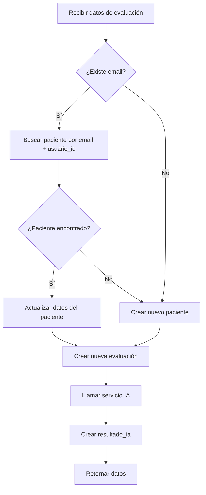

# Lógica de Reutilización de Pacientes - Implementación

## Cambio Implementado

Se modificó el servicio `crearEvaluacionInterna` en [`evaluacion.service.js`](file:///d:/Desktop/Preespecialdiad%20UTEC/cardioriesgo-backend/src/services/evaluacion.service.js) para **evitar duplicados de pacientes** basándose en el email.

## Flujo de Lógica



## Comportamiento

### Caso 1: Paciente Existente (mismo email + mismo médico)

**Entrada:**

```json
{
  "email": "john.smith@email.com",
  "usuario_id": 5,
  "nombre_completo": "John Smith",
  ...
}
```

**Acción:**

1. ✅ Busca paciente con `email = "john.smith@email.com"` AND `usuario_id = 5`
2. ♻️ **Reutiliza** el paciente existente
3. 🔄 **Actualiza** sus datos (edad, teléfono, nombre, etc.)
4. ✨ **Crea** nueva `evaluacion_clinica` vinculada al paciente existente
5. ✨ **Crea** nuevo `resultado_ia`
6. ✨ **Crea** nuevo `reporte_clinico`

**Resultado:**

- 1 paciente (existente, actualizado)
- N evaluaciones (nueva + anteriores)
- N resultados IA (nuevo + anteriores)
- N reportes (nuevo + anteriores)

### Caso 2: Paciente Nuevo

**Entrada:**

```json
{
  "email": "maria.nueva@email.com",
  "usuario_id": 5,
  ...
}
```

**Acción:**

1. ✅ Busca paciente con `email = "maria.nueva@email.com"` AND `usuario_id = 5`
2. ❌ No encuentra ninguno
3. ✨ **Crea** nuevo paciente
4. ✨ **Crea** nueva `evaluacion_clinica`
5. ✨ **Crea** nuevo `resultado_ia`
6. ✨ **Crea** nuevo `reporte_clinico`

**Resultado:**

- 1 paciente (nuevo)
- 1 evaluación (nueva)
- 1 resultado IA (nuevo)
- 1 reporte (nuevo)

## Criterios de Búsqueda

El paciente se busca por **DOS criterios**:

1. **Email**: `email = data.email`
2. **Usuario/Médico**: `usuario_id = data.usuario_id`

> **Importante:** Esto significa que el mismo paciente (mismo email) puede existir múltiples veces si es atendido por diferentes médicos. Cada médico tendrá su propia copia del paciente.

## Datos que se Actualizan

Cuando se reutiliza un paciente existente, se actualizan:

- ✅ `edad`
- ✅ `sexo`
- ✅ `fecha_nacimiento`
- ✅ `telefono`
- ✅ `nombre_completo`

**NO se actualiza:**

- ❌ `email` (se usa como identificador)
- ❌ `usuario_id` (se usa como identificador)

## Logs en Consola

El sistema muestra mensajes informativos:

```bash
# Paciente nuevo
✅ Nuevo paciente creado: John Smith (ID: 45)

# Paciente existente
♻️  Paciente existente reutilizado: John Smith (ID: 41)
```

## Ventajas

1. **Evita duplicados** de pacientes con el mismo email
2. **Mantiene historial** de evaluaciones por paciente
3. **Actualiza información** del paciente en cada evaluación
4. **Permite seguimiento** temporal del mismo paciente

## Ejemplo de Uso

```javascript
// Primera evaluación - Crea paciente
POST /api/reportes/generar
{
  "email": "john@email.com",
  "usuario_id": 5,
  "nombre_completo": "John Smith",
  "edad": 58,
  ...
}
// Resultado: Paciente ID 41 creado

// Segunda evaluación (6 meses después) - Reutiliza paciente
POST /api/reportes/generar
{
  "email": "john@email.com",  // Mismo email
  "usuario_id": 5,             // Mismo médico
  "nombre_completo": "John Smith",
  "edad": 59,                  // Edad actualizada
  ...
}
// Resultado: Paciente ID 41 reutilizado y actualizado
```

## Verificación

Para verificar el historial de un paciente:

```javascript
GET / api / reportes / paciente / 41;
// Retorna todas las evaluaciones del paciente
```
